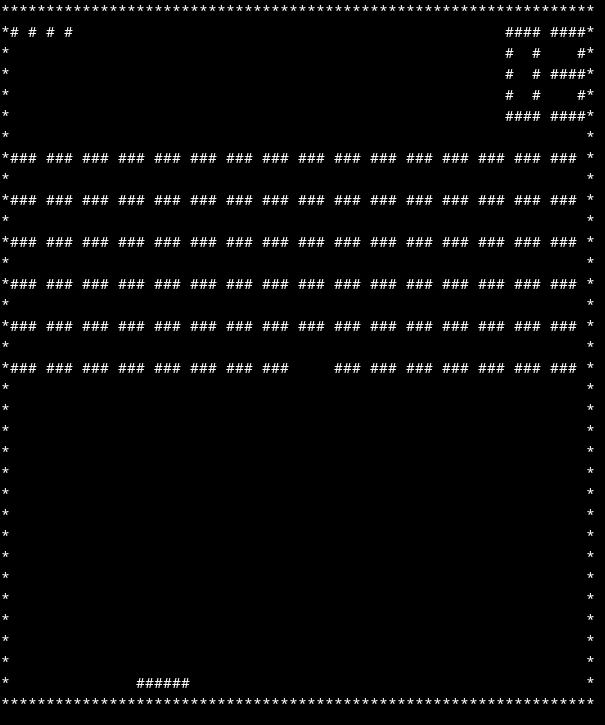
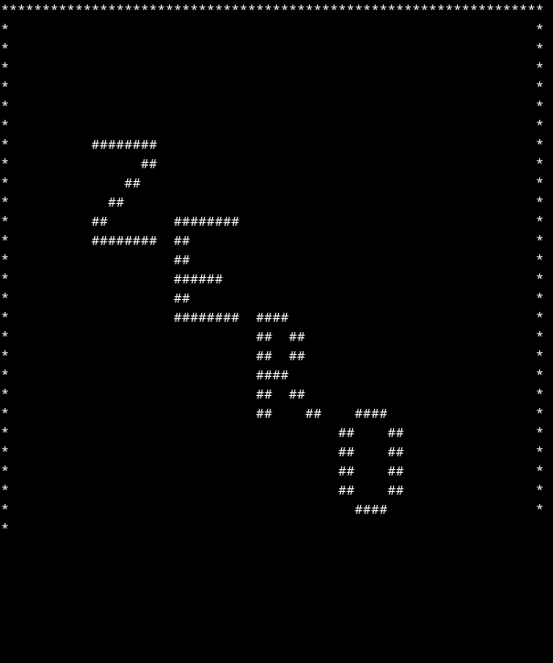
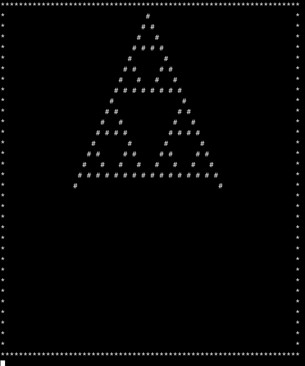
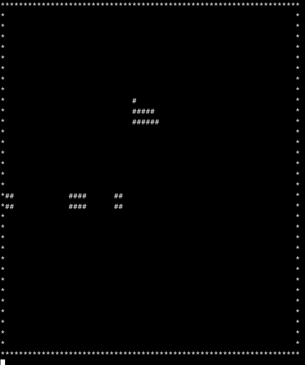

# CHIP8

## What is CHIP-8?
CHIP8 is a emulator for the CHIP-8 programming language, once popular for playing games on what are now old microprocessors. More information can be found at [wikipedia](https://en.wikipedia.org/wiki/CHIP-8). Additionally the reference used to implement each of the instructions was found [here](http://devernay.free.fr/hacks/chip8/C8TECH10.HTM).

## How to play?
To play a game, in your terminal simply run `main` with a provided CHIP-8 program found in `demofiles/`. For example to play breakout run `main demofiles/breakout.ch8`.

***NOTE***:If the provided exectuable is not working you will need to run the `make` command first to rebuild the exectuable for your machine. Before building esure that you machine has the required ncurses files required to display the games from the terminal.

## Programs available
Three programs have been included in the `demofiles/` directory.

### breakout.ch8

This is the classic game of breakout that you may have played on your blackberry. Rules are simple you have a paddle that you need to move to hit a moving ball with the goal of the game being to break all of the bricks on the other side without the ball getting past you.

Controls:
Move paddle left: `4`
Move paddle right: `6`

### zero.ch8

This is just a little fun animation of the word zero with the letters moving around the screen.

### sierpinski.ch8

Simple program to print out the famous Sierpinski triangle.

### blitz.ch8

Not my favorite game but it's not bad. Goal of the game is to drop a projectile to remove columns as your ship is flying missing creates another column that you need to destroy.

Controls:
Start dropping projectiles: `5`
Stop dropping projectiles: `3`
